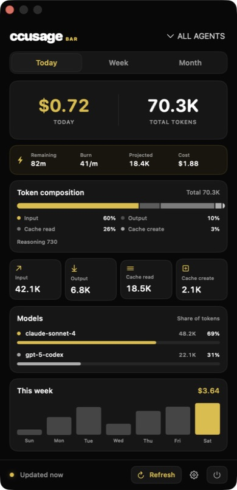

<div align="center">
  
  <h1>ccusage Bar</h1>
  <p>A native macOS menu bar companion for tracking AI coding usage and cost at a glance.</p>
  <p>
    
    
    <a href="LICENSE"></a>
  </p>
  <p><a href="https://github.com/CristianKhalilSC/ccusage-bar/releases/latest"><strong>Download the latest DMG</strong></a></p>
</div>

ccusage Bar keeps the numbers that matter in the macOS menu bar. Open its compact popover to compare today, the last seven days, and the current month without returning to a terminal.

It reads local reports from [`ccusage`](https://github.com/ccusage/ccusage), supports unified and agent-specific views, and does not require an account or hosted service.

<div align="center">
  
  <p><sub>The app running on macOS with sample usage data.</sub></p>
</div>

## Highlights

- Today's output tokens and estimated cost directly in the menu bar
- Today, Week, and Month views with token and cost totals
- Input, output, cache-read, cache-creation, and reasoning-token breakdowns
- Per-model usage and daily activity charts
- Unified, Claude, Codex, and automatically detected agent filters
- Active Claude billing-block status and projections when available
- Automatic refresh every 60 seconds, plus manual refresh with `Command-R`
- Last successful values remain visible if a refresh fails
- Optional launch at login
- Native SwiftUI and AppKit interface with no Dock icon

## Requirements

- macOS 14 Sonoma or newer
- Apple silicon or Intel Mac
- A globally installed [`ccusage`](https://github.com/ccusage/ccusage) executable
- Local usage data from at least one coding-agent CLI supported by `ccusage`

ccusage Bar is a graphical companion to `ccusage`; it does not collect usage data itself. Install the CLI globally before opening the app:

```bash
npm install --global ccusage@latest
ccusage --version
```

The app searches the current `PATH`, `/opt/homebrew/bin/ccusage`, and `/usr/local/bin/ccusage`. A Node installation managed by Homebrew normally places the global executable in one of these locations.

## Installation

1. Download `ccusage-Bar.dmg` from the [latest release](https://github.com/CristianKhalilSC/ccusage-bar/releases/latest).
2. Open the DMG and drag **ccusage Bar** into **Applications**.
3. Launch the app from Applications. Its icon and current usage will appear in the menu bar.

> [!IMPORTANT]
> Current builds are unsigned and unnotarized. On first launch, macOS may prevent the app from opening. After attempting to open it, go to **System Settings → Privacy & Security**, select **Open Anyway**, and confirm. Only bypass this warning for a DMG downloaded from this repository. See [Apple's instructions for opening an app from an unidentified developer](https://support.apple.com/en-us/102445).

## Using the App

Select the menu bar item to open the popover. Use the tabs to switch periods and the agent menu to focus on a specific source. The footer provides refresh, settings, and quit controls.

To start ccusage Bar automatically, open the gear menu and enable **Launch at Login**. macOS may ask you to approve it under **System Settings → General → Login Items & Extensions**.

If the app cannot find `ccusage`, confirm that `ccusage --version` works in Terminal and that the executable is installed in one of the supported locations above.

## Privacy

ccusage Bar reads usage reports by running the local `ccusage` command. The app itself has no account system, analytics, telemetry, or cloud sync, and it does not upload your usage data.

Cost values are estimates produced from the data and pricing available to `ccusage`. Refer to the [upstream documentation](https://ccusage.com/) for its data sources, pricing behavior, and supported coding agents.

## Development

The project uses Swift Package Manager and requires a Swift 6 toolchain:

```bash
git clone https://github.com/CristianKhalilSC/ccusage-bar.git
cd ccusage-bar
swift build
swift run ccusage-core-tests
swift run ccusage-bar
```

Running through Swift Package Manager is suitable for development, but launch-at-login registration requires a packaged `.app` installed in Applications.

The codebase is split into two targets:

| Target | Responsibility |
| --- | --- |
| `ccusageBarApp` | macOS lifecycle, menu bar, popover, and system integration |
| `ccusageCore` | CLI discovery, command execution, normalization, models, and formatting |

Bug reports and focused pull requests are welcome through [GitHub Issues](https://github.com/CristianKhalilSC/ccusage-bar/issues).

## Acknowledgements

ccusage Bar is built on the reports provided by [`ccusage`](https://github.com/ccusage/ccusage). It is an independent companion project and is not affiliated with the upstream maintainers or supported coding-agent vendors.

## License

Licensed under the [MIT No Attribution License](LICENSE).
