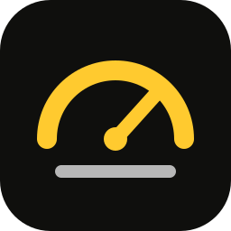
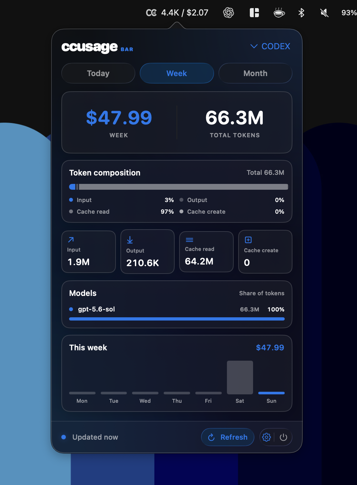

<div align="center">
  
  <h1>ccusage Bar</h1>
  <p>A native macOS menu bar companion for tracking local AI coding usage and estimated cost at a glance.</p>
  <p>
    
    
    <a href="LICENSE"></a>
  </p>
  <p><a href="#run-from-source"><strong>Build and run from source</strong></a></p>
</div>

ccusage Bar keeps the numbers that matter in the macOS menu bar. Open its compact popover to compare today, the trailing seven days, and the current calendar month without returning to a terminal.

It reads local reports from [`ccusage`](https://github.com/ccusage/ccusage), supports all-agent and source-specific views, and does not require an account or hosted service.

<div align="center">
  
  <p><sub>A Codex-only weekly view using a custom blue accent.</sub></p>
</div>

## Highlights

- Today's output tokens and estimated cost directly in the menu bar
- Today, Week, and Month views with token and cost totals
- Input, output, cache-read, cache-creation, and optional reasoning-token breakdowns
- Per-model token shares and daily output-token charts
- All Agents, Claude, Codex, and automatically detected source filters
- Active Claude billing-block metrics and projections when available
- Eight accent presets plus a custom macOS color picker
- Frosted, adaptive surfaces with a reduced-transparency fallback
- Automatic refresh every 60 seconds, plus manual refresh with `Command-R`
- Last successful values remain visible if a refresh fails
- Optional launch at login
- Native SwiftUI and AppKit interface with no Dock icon

## Requirements

- macOS 14 Sonoma or newer
- Apple silicon or Intel Mac
- A globally installed [`ccusage`](https://github.com/ccusage/ccusage) executable
- Local usage data from at least one coding-agent CLI supported by `ccusage`
- A Swift 6 toolchain to build the app from source

ccusage Bar is a graphical companion to `ccusage`; it does not collect usage data itself. The app launches the `ccusage` executable directly, so a package-runner command such as `npx ccusage` is not sufficient on its own. Install the CLI globally before opening the app:

```bash
npm install --global ccusage@latest
ccusage --version
```

The app searches the current `PATH`, `/opt/homebrew/bin/ccusage`, and `/usr/local/bin/ccusage`. A Node installation managed by Homebrew normally places the global executable in one of these locations. See the [ccusage installation guide](https://ccusage.com/guide/installation) for other global installation options.

## Run from Source

Prebuilt releases are not currently published. Clone the repository and launch the app with Swift Package Manager:

```bash
git clone https://github.com/CristianKhalilSC/ccusage-bar.git
cd ccusage-bar
swift run ccusage-bar
```

The process remains attached to the terminal until you quit the app. Launch at Login requires a packaged `.app` installed in Applications and is unavailable when running directly through Swift Package Manager.

## Using the App

The menu bar item shows today's output tokens and estimated cost. Select it to open the popover, use the tabs to switch periods, and use the source menu to choose All Agents or focus on one coding agent. The app remembers the selected source and accent color between launches.

Choose one of the preset accents from the gear menu or open the macOS color picker with **Custom…**. A packaged app can also enable **Launch at Login** there; macOS may ask you to approve the login item under **System Settings → General → Login Items & Extensions**.

The app refreshes whenever the popover opens and every 60 seconds while it is running. Use the footer button or press `Command-R` to refresh immediately, and press `Command-Q` to quit.

If the app cannot find `ccusage`, confirm that `ccusage --version` works in Terminal and that the executable is installed in one of the supported locations above.

## Privacy

ccusage Bar reads usage reports by running the local `ccusage` command. The app itself has no account system, analytics, telemetry, or cloud sync, and it does not upload your usage data.

Cost values are estimates produced from the data and pricing available to `ccusage`. Refer to the [upstream documentation](https://ccusage.com/) for its data sources, pricing behavior, and supported coding agents.

## Development

The project uses Swift Package Manager. From the repository root:

```bash
swift build
swift run ccusage-core-tests
swift run ccusage-bar
```

The codebase is split into two targets:

| Target | Responsibility |
| --- | --- |
| `ccusageBarApp` | macOS lifecycle, menu bar, popover, and system integration |
| `ccusageCore` | CLI discovery, command execution, normalization, models, and formatting |

Bug reports and focused pull requests are welcome through [GitHub Issues](https://github.com/CristianKhalilSC/ccusage-bar/issues).

## Acknowledgements

ccusage Bar is built on the reports provided by [`ccusage`](https://github.com/ccusage/ccusage). It is an independent companion project and is not affiliated with the upstream maintainers or supported coding-agent vendors.

## License

Licensed under the [MIT No Attribution License](LICENSE).
